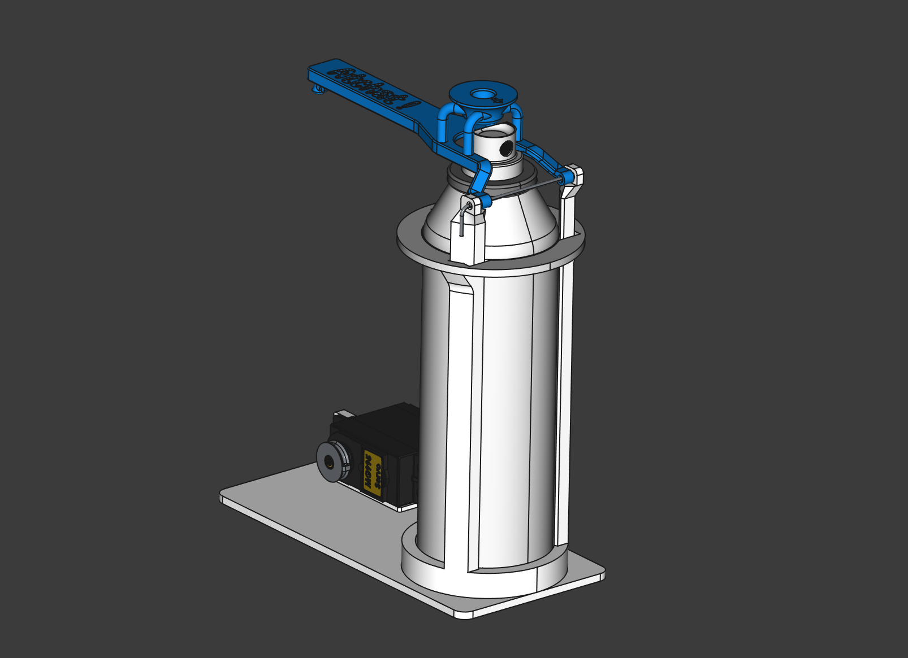

# Atchat Firmware (ATtiny85)

This firmware is part of the Atchat project, a system designed to protect your cat's food from neighborhood intruders. The main project uses object recognition with a webcam to detect cats and distinguish your own cat from others. If a rogue cat is detected approaching the food bowl, a water spray is activated to deter the trespasser.

## Overview

This firmware runs on an ATtiny85 microcontroller. It is responsible for controlling a servo motor that operates the water spray mechanism. The firmware communicates with the host (e.g., a Raspberry Pi or PC running the object recognition software) via simple AT commands.

## Features

- **AT Command Interface:**
  - `AT+VER?` — Returns the firmware version. Use this to verify communication and firmware compatibility.
  - `AT+SPRAY=<x>` — Activates the spray for `<x>` × 500ms (e.g., `AT+SPRAY=2` sprays for 1 second).
- **Servo Control:**
  - The spray is released by moving the servo to 90°.
  - The spray is stopped by returning the servo to 0°.

## Usage

1. **Connect the ATtiny85** to your main controller (e.g., via UART or USB-Serial adapter).
2. **Send AT commands** from your host software to control the spray mechanism.
3. **Integrate with object recognition**: The host software should send the appropriate AT commands when a rogue cat is detected.

## Dependencies

- [ATCommands](https://platformio.org/lib/show/yourapiexpert/ATCommands)
- [Servo](https://platformio.org/lib/show/arduino-libraries/Servo)

## License

MIT License. See [LICENSE](../LICENSE) for details.

---

_Protect your cat, keep the food safe, and deter unwanted feline visitors!_
