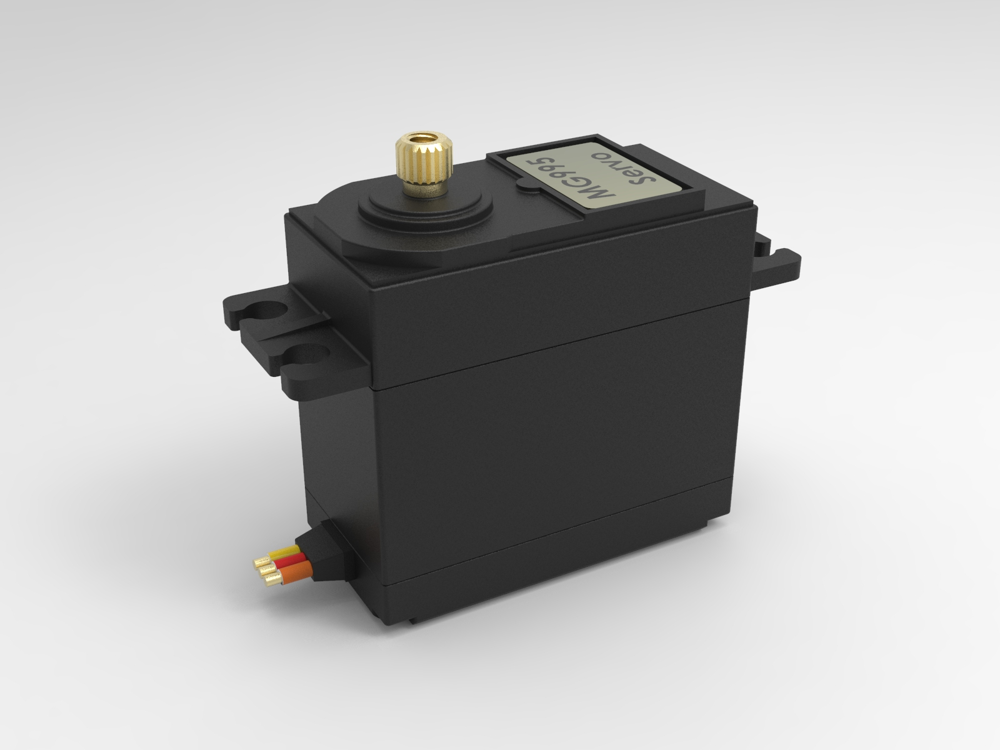
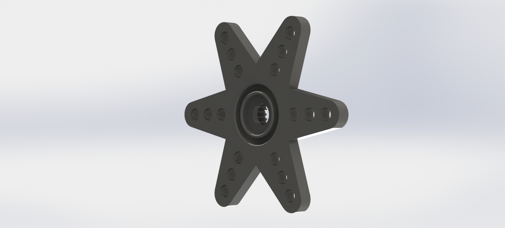

# Atchat - Cat Food Protection System

An automated cat deterrent system that recognizes cats stealing food and sprays them with water to protect your cat's food from intruders.

## Project Overview

Atchat is designed to solve the problem of stray or neighbor cats entering your home and stealing your cat's food. The system uses computer vision to detect unauthorized cats and automatically activates a water sprayer to deter them while keeping your own cat's food safe.

## CAD Models

This repository contains the 3D CAD models and mechanical components for the Atchat project:

### Files Structure

```plain
CAD/
├── mg995-servo-motor-2/           # MG995 servo motor model
│   ├── MG995.1.jpg               # Product image
│   ├── MG995.IGS                 # IGES format
│   ├── MG995.STEP                # STEP format
│   └── MG995.STL                 # STL format for 3D printing
├── Servo_MG995_Star_horn/        # Servo horn/gear for MG995
│   ├── Servo_MG995_Star_horn.IGS # IGES format
│   ├── Servo_MG995_Star_horn.SLDPRT # SolidWorks part file
│   ├── Servo_MG995_Star_horn.STEP # STEP format
│   └── View.JPG                  # Component view
└── Sprayer/                      # Custom water sprayer design
    └── Sprayer.FCStd             # FreeCAD design file
```

## Component Details

### MG995 Servo Motor



- **Source**: [GrabCAD Library](https://grabcad.com/library/mg995-servo-motor-2)
- **Author**: Amine Bouabid
- **Uploaded**: February 8th, 2021
- **Categories**: Components, Electrical, Robotics
- **Tags**: robot, automation, servomotor, servo, electronics
- **Downloads**: 9,037+
- **Available Formats**: STEP, IGES, STL, JPG
- **Description**: Detailed 3D model of the MG995 servo motor commonly used in robotics and automation projects

### MG995 Star Horn/Gear



- **Source**: [GrabCAD Library](https://grabcad.com/library/mg995-star-horn-gear-1)
- **Author**: Sébastien Bourgeois
- **Uploaded**: April 13th, 2022
- **Categories**: Industrial design, Machine design, Robotics
- **Tags**: gear, mg995, horn, servo motor
- **Downloads**: 2,731+
- **Available Formats**: STEP, IGES, SOLIDWORKS, JPG
- **Description**: Star horn gear supplied with MG995 servo motor for mechanical connections

### Custom Sprayer (Original Design)

- **Author**: Theo (Project Creator)
- **Tool**: FreeCAD
- **Description**: Custom-designed water sprayer mechanism optimized for the Atchat system
- **Status**: Original creation for this project

## Licensing and Attribution

### GrabCAD Components

The MG995 servo motor and star horn models are sourced from [GrabCAD](https://grabcad.com/) under their community terms:

- **License**: [GrabCAD Terms of Use](https://grabcad.com/terms)
- **Usage Rights**: Non-commercial, internal use as per GrabCAD's Cross License terms
- **Attribution**: Required - see individual component details above
- **Disclaimer**: These CAD files are created and managed by third-party community members and are not affiliated with the actual MG995 manufacturer

### Original Components

- **Sprayer Design**: © 2025 Theo - Original creation for the Atchat project
- **License**: All rights reserved (or specify your preferred license)

## Technical Specifications

- **Servo Motor**: MG995 high-torque digital servo
- **Operating Voltage**: 4.8V - 7.2V
- **Torque**: 8.5kg·cm (4.8V), 10kg·cm (6V)
- **Speed**: 0.2s/60° (4.8V), 0.16s/60° (6V)
- **Materials**: Various (as per original component specifications)

## Usage Notes

1. **File Formats**: Multiple CAD formats provided for compatibility with different design software
2. **3D Printing**: STL files available for prototyping and manufacturing
3. **Integration**: Components designed to work together in the complete Atchat system
4. **Modifications**: Feel free to modify the sprayer design to suit your specific needs

## Project Status

🚧 **In Development** - This project is currently under active development.

## Contact

For questions about the project or custom modifications, please contact the project maintainer.

---

**Disclaimer**: This project is for educational and personal use. Ensure compliance with local regulations regarding animal deterrent devices and water usage.
